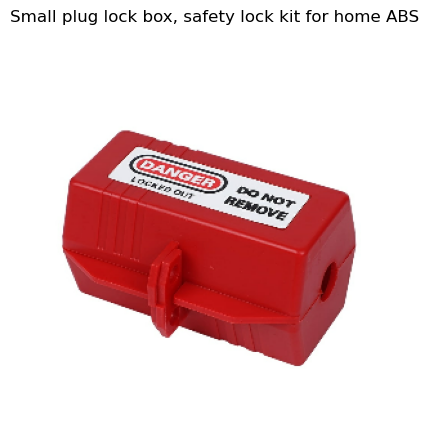
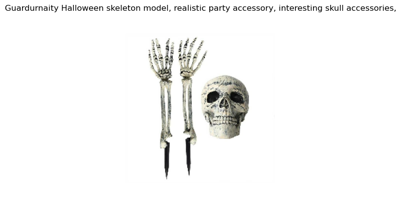
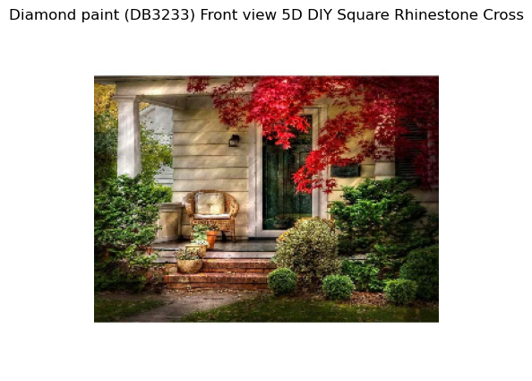
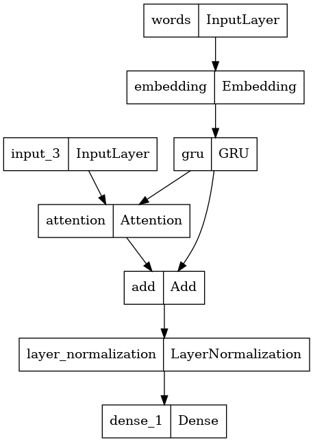
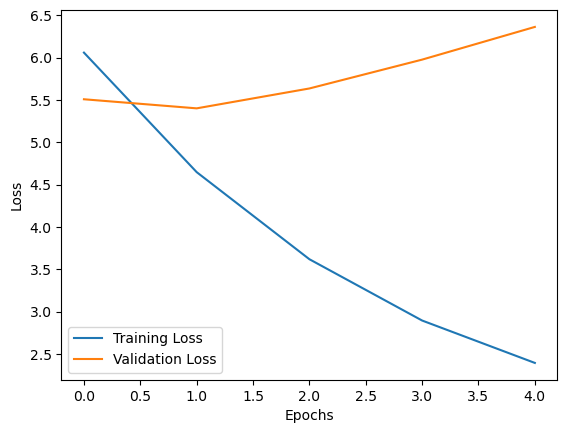
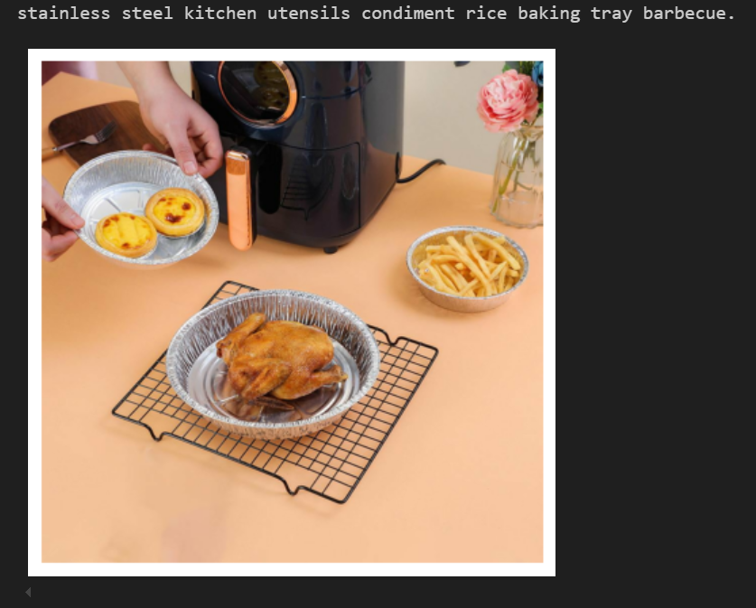
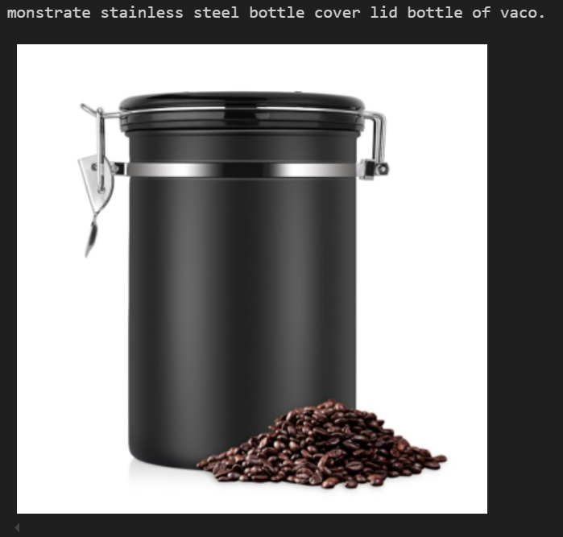
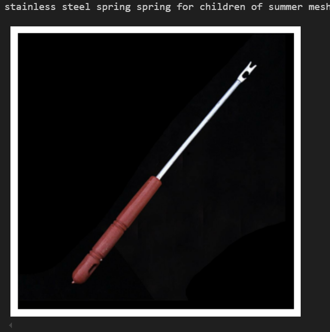

# Product Image Captioning

## Learning Objectives

Learn how to train and predict a text generation model based on a product image.

Image captioning models take an image as input, and output text. Ideally, we want the output of the model to accurately describe the events/things in the image, similar to a caption a human might provide.

## Dataset

The dataset used encompass to variety types of product. Total of 40k images are used for training and 1,000 for validation.
### Example Images

# Algorithm
This model is composed of two primary components: an image encoder and a caption decoder.

### Image Encoder
The image encoder is designed to be straightforward yet effective. It leverages a pre-trained convolutional neural network (InceptionResNetV2) to extract high-level features from the input image. These features are then passed through a fully connected (dense) layer to transform them into a suitable format for the caption decoder. This process ensures that the encoder captures the essential visual information needed for generating accurate and contextually relevant captions.

### Caption Decoder
The caption decoder incorporates an attention mechanism that allows the model to selectively concentrate on the most relevant parts of the image, thereby improving the quality and coherence of the generated captions. The decoder consists of Gated Recurrent Units (GRUs), which are adept at handling the sequential nature of language data.

# Training Result
The model validation loss does not reduce. However the training loss reduces at every epoch. This suggest that the model is indeed learning however it could not generalize to the validation dataset.

The main reason for this is that the dataset distribution is varse. There are too much product variety in these dataset. 

In order to scale it up, we could try to increase the number of image for training logarithmatically. In otherwords from 40k to 400k to check if the validation loss increases.

# Example of Predicted Outputs

